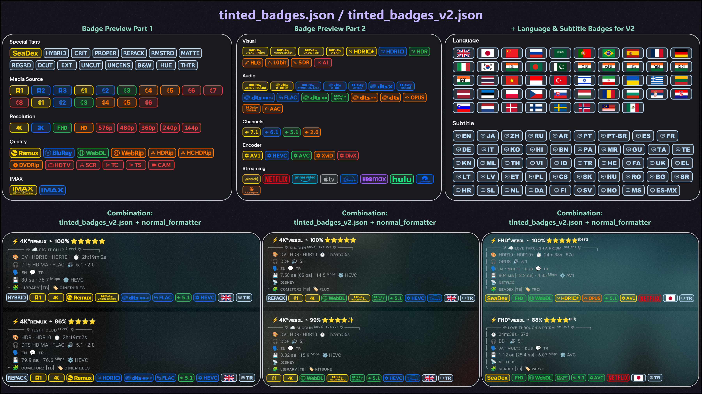
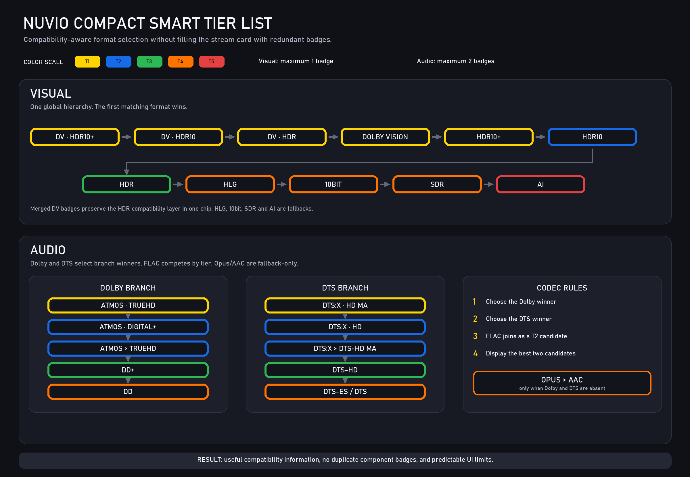

# 🎨 Kingsize Nuvio Badges

Kingsize Nuvio Badges is a badge pack and formatter set for
[Nuvio](https://github.com/NuvioMedia). It turns stream metadata into compact
visual badges for source, resolution, quality, HDR, audio, channels, encoder,
streaming service, language, subtitles, and special tags.

The repo includes 7 badge styles, V1 badge packs for any formatter, Instant V2
badge packs for marker-enabled AIOStreams formatters, 5 ready-to-use formatters,
and a marker template for custom formatters.

> **Note:** For the best and smoothest Nuvio experience, you'll need a debrid service, and currently, [***TorBox***](https://torbox.app/subscription?referral=83bdd6a7-e951-4a82-8be4-99e5c6c97074) is the most affordable and highly recommended one. You can also share your Nuvio setup with your friends/family to use it together. If it's your first ever purchase, use my [***referral***](https://torbox.app/subscription?referral=83bdd6a7-e951-4a82-8be4-99e5c6c97074) and we both get +84 extra days on a yearly plan or +7 extra days on a monthly one.  
> **Referral Code:** 83bdd6a7-e951-4a82-8be4-99e5c6c97074

## 🖼️ Diagram Previews

Each preview diagram shows one badge pack and one formatter combination. The
top row shows the badges included in the pack, while the bottom row shows how
that pack looks when combined with a formatter on real stream results.

Use these previews to choose a ready-made badge pack + formatter combination,
or mix any badge pack with any included formatter to create your own setup.

Other Diagram Previews:
[Default Colored Badges](docs/previews/badge.json.png) ·
[Colored Outline Badges](docs/previews/colored_outline_badges.json.png) ·
[Solid Badges](docs/previews/solid_badges.json.png) ·
[White Badges](docs/previews/white_badges.json.png) ·
[Mono White Badges](docs/previews/mono_white_badges.json.png) ·
[Black Badges](docs/previews/black_badges.json.png)

## 🔗 Raw URLs

### Formatters

| Formatter | File | Raw URL |
|---|---|---|
| Normal | [normal_formatter](normal_formatter.json) | [Raw URL](https://raw.githubusercontent.com/kingsizew/badges/main/normal_formatter.json) |
| Minimalist with emojis | [minimalist_with_emojis](minimalist_with_emojis.json) | [Raw URL](https://raw.githubusercontent.com/kingsizew/badges/main/minimalist_with_emojis.json) |
| Minimalist without emojis | [minimalist_no_emojis](minimalist_no_emojis.json) | [Raw URL](https://raw.githubusercontent.com/kingsizew/badges/main/minimalist_no_emojis.json) |
| Tamtaro Default | [tamtaro_default_formatter](tamtaro_instant_formatter.json) | [Raw URL](https://raw.githubusercontent.com/kingsizew/badges/main/tamtaro_instant_formatter.json) |
| Tamtaro Minimalist | [tamtaro_minimalist_formatter](tamtaro_minimalist_instant_formatter.json) | [Raw URL](https://raw.githubusercontent.com/kingsizew/badges/main/tamtaro_minimalist_instant_formatter.json) |
| Marker template for custom formatters | [markers_for_custom_formatters](markers_for_custom_formatters.json) | [Raw URL](https://raw.githubusercontent.com/kingsizew/badges/main/markers_for_custom_formatters.json) |

**Note:** Only Tam’s default formatter exceeds the 5,000-character limit. If
you want to use Tam’s default formatter with V2 badge packs, use the
[Kuu instance](https://aiostreams-nightly.206111.xyz/stremio/configure?menu=about&template=https://raw.githubusercontent.com/Tam-Taro/SEL-Filtering-and-Sorting/main/Tamtaro-All-Templates-for-AIOStreams.json).

### V1 Badge Packs

V1 packs work with any formatter and use Nuvio's normal badge matching.

| Style | File | Raw URL |
|---|---|---|
| Default Colored | [badge.json](badge.json) | [Raw URL](https://raw.githubusercontent.com/kingsizew/badges/main/badge.json) |
| Tinted | [tinted_badges.json](tinted_badges.json) | [Raw URL](https://raw.githubusercontent.com/kingsizew/badges/main/tinted_badges.json) |
| Colored Outline | [colored_outline_badges.json](colored_outline_badges.json) | [Raw URL](https://raw.githubusercontent.com/kingsizew/badges/main/colored_outline_badges.json) |
| Solid | [solid_badges.json](solid_badges.json) | [Raw URL](https://raw.githubusercontent.com/kingsizew/badges/main/solid_badges.json) |
| White | [white_badges.json](white_badges.json) | [Raw URL](https://raw.githubusercontent.com/kingsizew/badges/main/white_badges.json) |
| Mono White | [mono_white_badges.json](mono_white_badges.json) | [Raw URL](https://raw.githubusercontent.com/kingsizew/badges/main/mono_white_badges.json) |
| Black | [black_badges.json](black_badges.json) | [Raw URL](https://raw.githubusercontent.com/kingsizew/badges/main/black_badges.json) |

### V2 Badge Packs

V2 packs are designed for the included formatters or a custom formatter based
on the marker template. They read compact hidden markers supplied by the
formatter for instant matching.

| Style | File | Raw URL |
|---|---|---|
| Default Colored | [badge_v2.json](badge_v2.json) | [Raw URL](https://raw.githubusercontent.com/kingsizew/badges/main/badge_v2.json) |
| Tinted | [tinted_badges_v2.json](tinted_badges_v2.json) | [Raw URL](https://raw.githubusercontent.com/kingsizew/badges/main/tinted_badges_v2.json) |
| Colored Outline | [colored_outline_badges_v2.json](colored_outline_badges_v2.json) | [Raw URL](https://raw.githubusercontent.com/kingsizew/badges/main/colored_outline_badges_v2.json) |
| Solid | [solid_badges_v2.json](solid_badges_v2.json) | [Raw URL](https://raw.githubusercontent.com/kingsizew/badges/main/solid_badges_v2.json) |
| White | [white_badges_v2.json](white_badges_v2.json) | [Raw URL](https://raw.githubusercontent.com/kingsizew/badges/main/white_badges_v2.json) |
| Mono White | [mono_white_badges_v2.json](mono_white_badges_v2.json) | [Raw URL](https://raw.githubusercontent.com/kingsizew/badges/main/mono_white_badges_v2.json) |
| Black | [black_badges_v2.json](black_badges_v2.json) | [Raw URL](https://raw.githubusercontent.com/kingsizew/badges/main/black_badges_v2.json) |

## 📥 How To Import

**For formatters:** copy the formatter raw URL, open the formatter section in
AIOStreams, and use **Import from URL**.
**For badge packs:** copy the badge pack raw URL, then open
**Nuvio Settings > Layout > Streams > Fusion Badge URLs** and add it there.

## ⚡ V1 vs V2

- All badge packs have **V1 and V2 versions**. The badge logic and appearance
  are the same; the main difference is speed and compatibility. V2
  packs also include Language and Subtitle badges. Don't worry about them
  cluttering your badge row: the badge pack only generates badges for the
  languages and subtitles you set as preferred in your AIOStreams config. You
  do not have to do anything else.
- I did not add Language or Subtitle badges to V1 because Nuvio's badge matcher
  scans general stream fields, and those fields do not provide consistent,
  dedicated language/subtitle data.
- The **V1 badge packs** work with any formatter. They use Nuvio's normal
  badge-matching system, so there can be a small slowdown because Nuvio has to
  scan and match the badge rules against the available stream fields.
- The **V2 badge packs** skip the heavier matching process by reading hidden
  markers embedded in marker-enabled formatters. Because badges are matched
  directly from these markers, they load essentially instantly.
- If you use one of the formatters provided above, use one of the **V2 badge
  packs**. If you use a different custom formatter, use one of the **V1 badge
  packs**. If you want to use a V2 badge pack with your own custom formatter,
  follow the guide below to make your formatter compatible with the V2 marker
  system.

## 🛠️ Create a Custom V2 Formatter

To make your own formatter compatible with the V2 badge packs:

1. Copy the raw URL for
   [`markers_for_custom_formatters.json`](https://raw.githubusercontent.com/kingsizew/badges/main/markers_for_custom_formatters.json).
2. Open the AIOStreams formatter section and use **Import from URL**.
3. Add your own visible formatter code before the existing marker code in the
   `name` and `description` fields.
4. Keep the invisible marker tokens unchanged. V2 badge packs read those tokens
   to generate the badges.
5. Keep each formatter field under the AIOStreams character limit. If one field
   gets too long, move some marker blocks between `name` and `description`.
6. If you do not need every Language or Subtitle badge, delete the unused
   language/subtitle replace entries from the marker template to save space.
7. Save the formatter, then import any V2 badge pack into Nuvio.

## 🧠 Badge Logic

Each V1 badge pack contains 100 badges. Each V2 badge pack contains those same badges plus 48 preferred-language badges and 48 preferred-subtitle badges, for 196 V2 badges total.

Ranked technical badge groups use five color tiers:

**T1 Gold > T2 Blue > T3 Green > T4 Orange > T5 Red**

For standard groups, higher-tier matches suppress lower-tier matches in the same
group. Visual and Audio badges use Smart Tier logic instead, so useful
compatibility information can stay visible when one simple winner would hide too
much detail.

## 📦 Included Badge Groups

| Group | Badges | Purpose |
|---|---:|---|
| Special Tags | 15 | SeaDex, corrected releases, alternate cuts, and presentation variants |
| Media Source | 17 | Ranked Remux, BluRay, and WEB profiles |
| Resolution | 9 | 4K through 144p |
| Quality | 12 | Remux, BluRay, WEB-DL, WEBRip, CAM, and others |
| IMAX | 2 | IMAX Enhanced and standard IMAX |
| Visual | 11 | Dolby Vision, HDR formats, HLG, 10bit, SDR, and AI |
| Audio | 16 | Dolby, DTS, FLAC, Opus, and AAC formats |
| Channels | 4 | 7.1, 6.1, 5.1, and 2.0 layouts |
| Encoder | 5 | AV1, HEVC, AVC, XviD, and DivX |
| Streaming | 9 | Streaming-service source badges |
| Language | 48 | Instant V2 preferred-language badges |
| Subtitle | 48 | Instant V2 preferred-subtitle badges |
| Total | 100 V1 / 196 V2 | |

<!-- README -->
